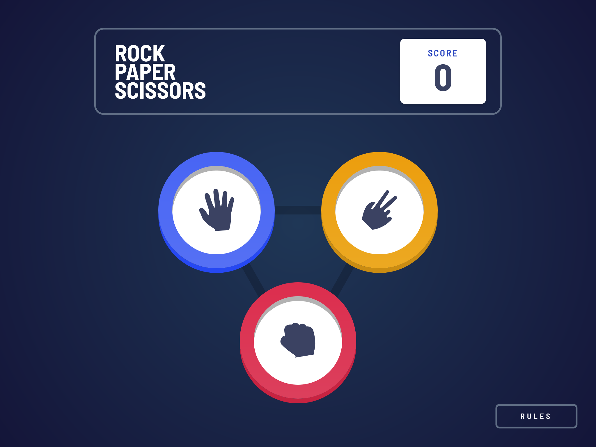

# Frontend Mentor - Rock, Paper, Scissors solution

This is a solution to the [Rock, Paper, Scissors challenge on Frontend Mentor](https://www.frontendmentor.io/challenges/rock-paper-scissors-game-pTgwgvgH). Frontend Mentor challenges help you improve your coding skills by building realistic projects.

## Table of contents

- [Overview](#overview)
  - [The challenge](#the-challenge)
  - [Screenshot](#screenshot)
  - [Links](#links)
- [My process](#my-process)
  - [Built with](#built-with)
  - [What I learned](#what-i-learned)
  - [Continued development](#continued-development)
  - [Useful resources](#useful-resources)
- [Author](#author)

**Note: Delete this note and update the table of contents based on what sections you keep.**

## Overview

### The challenge

Users should be able to:

- View the optimal layout for the game depending on their device's screen size
- Play Rock, Paper, Scissors against the computer
- Maintain the state of the score after refreshing the browser _(optional)_
- **Bonus**: Play Rock, Paper, Scissors, Lizard, Spock against the computer _(optional)_

### Screenshot

### Links

- Solution URL: [Frontend Mentor](https://www.frontendmentor.io/solutions/rock-paper-scissors-styledcomponents-react-router-ow_zqKZQRw)
- Live Site URL: [Vercel](https://fm-rock-paper-scissors.vercel.app/)

## My process

### Built with

- Semantic HTML5 markup
- CSS custom properties
- Flexbox
- CSS Grid
- Mobile-first workflow
- [React](https://reactjs.org/) - JS library
- [Styled Components](https://styled-components.com/) - For styles
- [React Router](https://reactrouter.com/en/main) - For game flow
- [Vite](https://vitejs.dev/) - For project creation

### What I learned

With this challenge I tested Vite for the creation of the project, I also had a more in-depth practice with CSS Grid and styled-components, using custom properties.

### Continued development

It's pending the bonus version, also add animations and some testing.

### Useful resources

- [A Complete Guide to Grid](https://css-tricks.com/snippets/css/complete-guide-grid/)
- [Gradient Borders](https://codyhouse.co/nuggets/css-gradient-borders)

## Author

- LinkedIn - [Raúl Barrera](https://www.linkedin.com/in/raubaca/)
- Frontend Mentor - [@raubaca](https://www.frontendmentor.io/profile/raubaca)
- Twitter - [@raubaca](https://www.twitter.com/raubaca)
